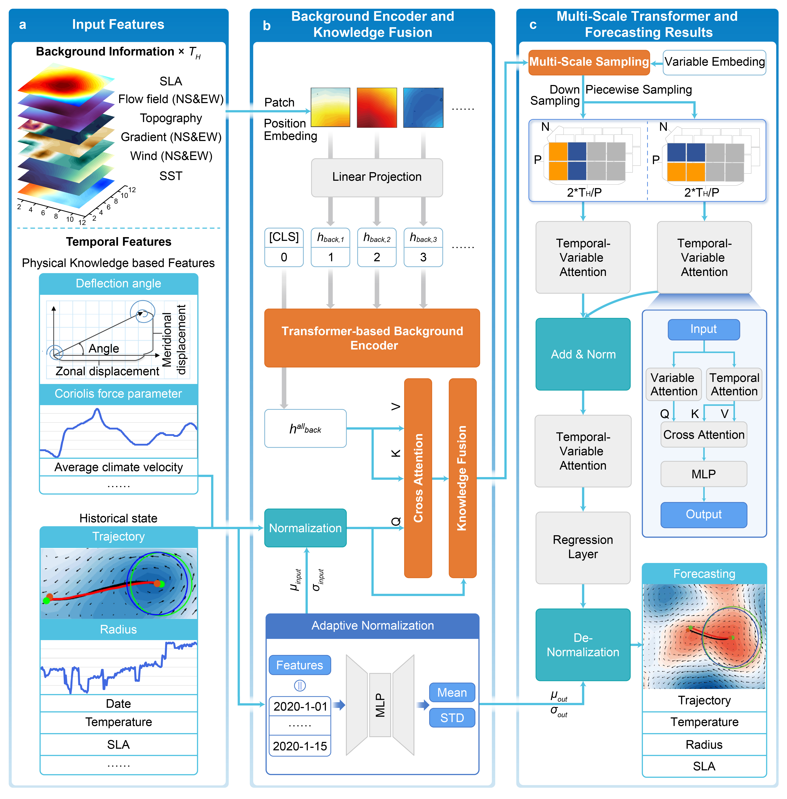

# Code for the proposed model: GC-EdCastX

This model effectively integrates temporal features and background field information to achieve global mesoscale eddy forecasting.

## The hyperparameters of our model
1. input_len: 15 (This paper follows the experimental settings of most existing spatiotemporal forecasting models, fixing both the length of historical observations and future forecasting to 12.)
2. output_len: 10
3. num_nodes: number of time series. METR-LA：207, PEMS04: 307, China AQI: 1300, Global wind: 2908
4. input_size: 3 (It represents the dimensions after concatenating the original time series with the two temporal embeddings, set to 3.)
5. if_T_i_D: True
6. if_D_i_W: True
7. embed_dim: 64 (For the basic introduction to these spatiotemporal embeddings, please refer to the original STID paper: https://github.com/GestaltCogTeam/STID.)
8. node_dim: 64
9. temp_dim_tid: 64
10. temp_dim_diw: 64
11. time_of_day_size: METR-LA and PEMS04: 288, China AQI: 24, Global wind: 1
12. day_of_week_size: 7
13. cl_hidden = 4  (Since contrastive learning requires dimensionality reduction of the representations, we provide two methods. The representation has the dimension [B, H, N, 1]. The first method reduces it to [B, H2, N], while the second method reduces it to [B, H2, 1].)
14. cl_student = 16
